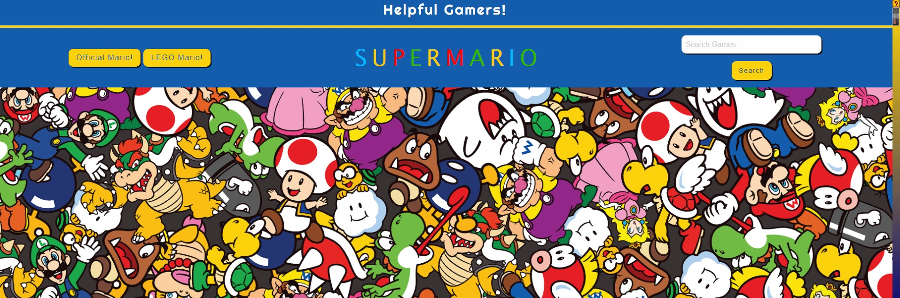

# Helpful-Gamers!

## Description

Helpful Gamers! is an application that allows users to search for any Mario game or term. In return, they are given a selection of YouTube videos and random snippets of MarioWiki information.


## Contributors

This is a helpful gaming website made by:
- Jeremy Hurst
- Charity Rogers
- LaMonica Arnold

## Built With

```
HTML
CSS
Foundation
JavaScript
Jquery
```

## Links

https://jhurst16.github.io/Helpful-Gaming

https://github.com/jhurst16/Helpful-Gaming

## Screenshot




